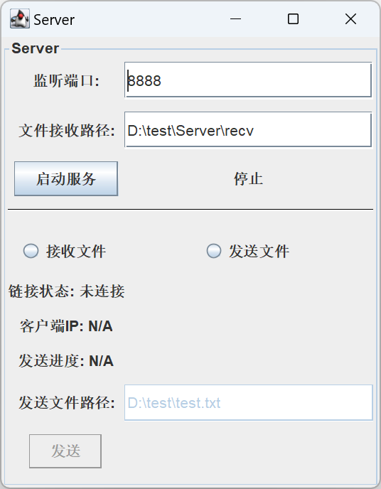
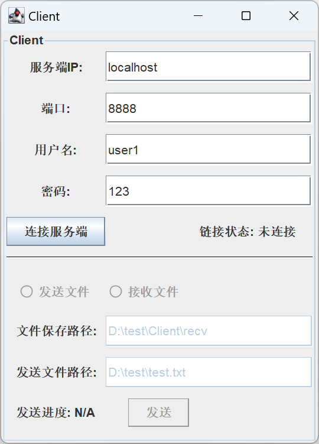

# FileTransferTool

A file transfer server and client GUI program developed in Java.

## Setup and usage

1. Install and configure jdk with version 1.8 or higher.

2. compile the java source code and run Server and Client separately.

## License
This project is licensed under the GNU General Public License v2.0 - see the [LICENSE](LICENSE) file for details.